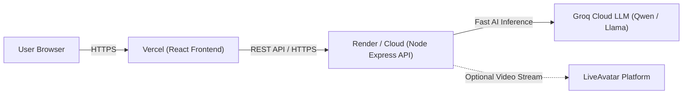

# Placement Twin — Cloud Deployment Guide

This guide walks you through deploying **Placement Twin** to **Vercel** (Frontend) and **Render** (Backend API + AI Inference) in under 5 minutes for **100% free**.

---

## Architecture Overview



---

## What You Need Before Starting

1. **A GitHub Account**: To push your code repository.
2. **A Free Vercel Account**: Sign up at [vercel.com](https://vercel.com).
3. **A Free Render Account**: Sign up at [render.com](https://render.com) (or Railway/Fly.io).
4. **A Free Groq API Key**: Get one in 10 seconds at [console.groq.com/keys](https://console.groq.com/keys) (No credit card needed).

---

## STEP 1: Push Code to GitHub

Open PowerShell in `placement-twin/` and initialize git (if not already done):

```bash
cd "d:\PROJECT\placement training\placement-twin"
git init
git add .
git commit -m "feat: complete placement-twin platform ready for Vercel deployment"
git branch -M main
git remote add origin https://github.com/YOUR_USERNAME/placement-twin.git
git push -u origin main
```

---

## STEP 2: Deploy Backend to Render (Free Web Service)

1. Log into [dashboard.render.com](https://dashboard.render.com).
2. Click **New +** → **Web Service**.
3. Connect your `placement-twin` GitHub repository.
4. Configure the settings:
   * **Name**: `placement-twin-api` (or any name you prefer)
   * **Region**: Nearest to your users (e.g., Singapore, Frankfurt, Oregon)
   * **Root Directory**: `backend`
   * **Environment**: `Node`
   * **Build Command**: `npm install`
   * **Start Command**: `node server.js`
   * **Instance Type**: `Free`
5. In **Environment Variables**, add:
   * `NODE_ENV` = `production`
   * `PORT` = `10000`
   * `GROQ_API_KEY` = `gsk_your_groq_api_key_here`
   * `GROQ_MODEL` = `llama-3.3-70b-versatile` (or `qwen-2.5-32b`)
   * *(Optional)* `LIVEAVATAR_API_KEY` = `your_liveavatar_key`
6. Click **Deploy Web Service**.
7. Copy your deployed backend URL (e.g., `https://placement-twin-api.onrender.com`).

---

## STEP 3: Deploy Frontend to Vercel

1. Log into [vercel.com](https://vercel.com).
2. Click **Add New...** → **Project**.
3. Import your `placement-twin` repository.
4. In the Project Configuration:
   * **Framework Preset**: `Vite`
   * **Root Directory**: click `Edit` and select `frontend` (or leave default if using root `vercel.json`)
   * **Build Command**: `npm run build`
   * **Output Directory**: `dist`
5. Expand **Environment Variables** and add:
   * **Name**: `VITE_BACKEND_URL`
   * **Value**: `https://placement-twin-api.onrender.com` *(Replace with your Render URL from Step 2)*
6. Click **Deploy**.

Your site will be live on Vercel at `https://your-project.vercel.app`! 🎉

---

## Testing Your Deployed Platform

* Open your Vercel URL in any browser.
* Test **Candidate Video Feed**: Will prompt for camera and microphone permissions over HTTPS.
* Test **AI Interview**: Conduct an adaptive interview; evaluations and scores will stream back in sub-second speed.
* Test **Coding Arena**: Run and submit Python 3 / Java algorithms with real test case results.
* Test **Progress & Leaderboard**: Track XP, level progression, and profile customization.
